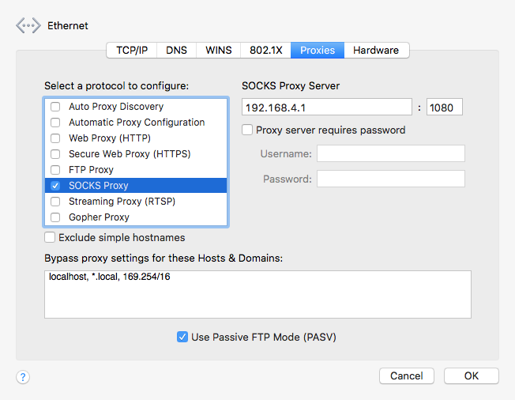

# Throttle HTTP/HTTPS/SOCKS proxy server

Sometimes you need to reduce network bandwidth in development environment.
The simplest way to do this is setup a proxy server and route all network
traffic to it.

Throttle proxy v2 deals with all kind of traffic without issues. 

## Installation and Usage

I recommend installing throttle-proxy globally. You can do so using npm:

    $ npm install -g throttle-proxy
    
After that, you can run throttle-proxy like this:

    $ throttle-proxy

And the last step is set SOCKS proxy server in the network preferences.
See an example of macOS preference panel below. Actually, there are
similar settings in Windows and Linux as well. 



The proxy supports “Automatic Proxy Configuration”. It’s the only way to
set up SOCKS proxy on iOS.


Open the following panel

    Settings -> WiFi -> HTTP Proxy

select “Automatic” and enter your proxy address (IP or domain name)
in URL field as per screenshots above.

## Options

Run `throttle-proxy --help` to see the following overview of the options:

```text
  Usage: throttle-proxy [options]

  Options:

    -p, --port <n>            incoming port number (default: 1080)
    -s, --incoming-speed <n>  max incoming speed (bps) (default: 100000)
        --outgoing-speed <n>  max outgoing speed (bps) (default: 100000)
    -d, --delay <n>           delay response by time in ms (default: 0)
        --pac-port <n>        PAC-server port number (default: 3128)
    -V, --version             output the version number
    -h, --help                output usage information

```

## Docker

You can run proxy using Docker image

    docker run -d -p 1080:1080 -p 3128:3128 mistakster/throttle-proxy

## Advanced usage

Proxy server can be used as a regular Node.js module:

```javascript
const proxy = require('throttle-proxy');

proxy({
  port: 1080,
  incomingSpeed: 100000,
  outgoingSpeed: 100000,
  delay: 0
});

```

## History

### 2.3.0

> 2018-10-05

- Added verbosity flag

### 2.2.0

> 2018-04-11

- Fixed wrong in/out throttles

### 2.1.0

> 2018-04-08

- Added proxy auto-config

### 2.0.0

> 2018-04-06

- Rewrote it as a SOCKS-proxy to allow handle all kind of traffic
- Implemented global speed limiter correctly

### 1.0.0

> 2018-04-04

- Have frozen development of the HTTP proxy 

### 0.8.0

> 2018-02-01

- Added external proxy support

### 0.7.0

> 2016-03-01

- Added `--help` option

### 0.6.0

> 2015-12-17

- Added `--delay` option

### 0.5.0

> 2015-09-24

- Implemented a hacky global speed limiter

### 0.4.2

> 2013-12-18

- Made a cosmetic refactoring

### 0.4.1

> 2013-09-11

- Fixed incorrect file mode

### 0.4.0

> 2013-08-27

- Introduced outgoing throttle

### 0.3.0

> 2013-08-08

- Added `--skip` option

### 0.2.1

> 2013-07-31

- Fixed documentation

### 0.2.0

> 2013-04-24

- Made a small refactoring

### 0.1.0

> 2013-04-22

- Made initial release

## Licence

MIT
